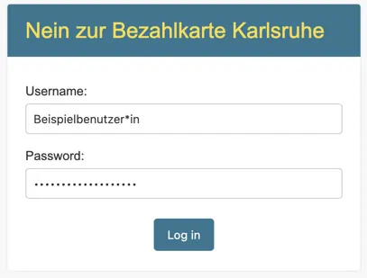
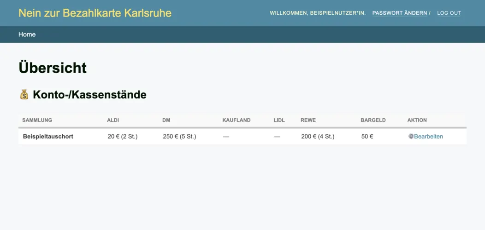
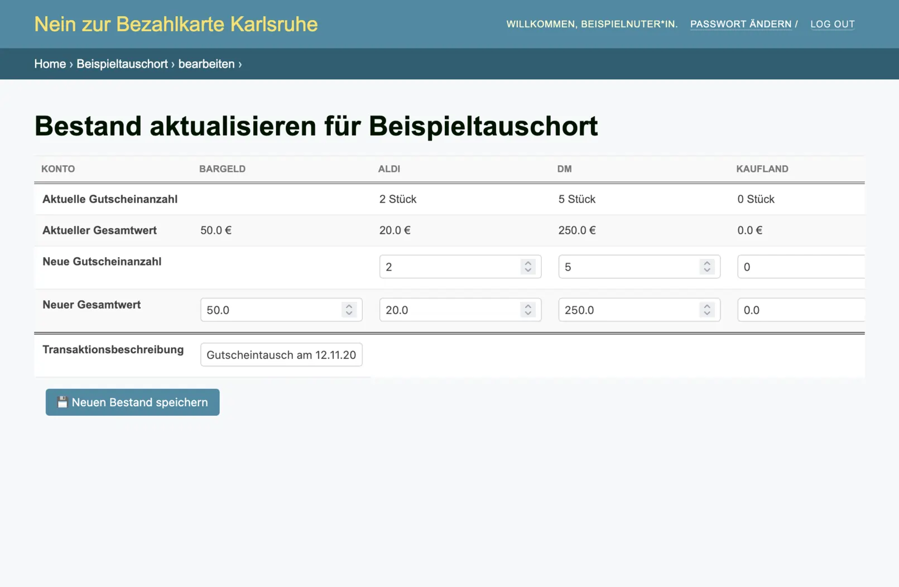
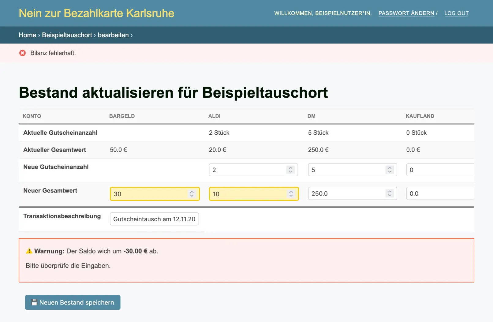
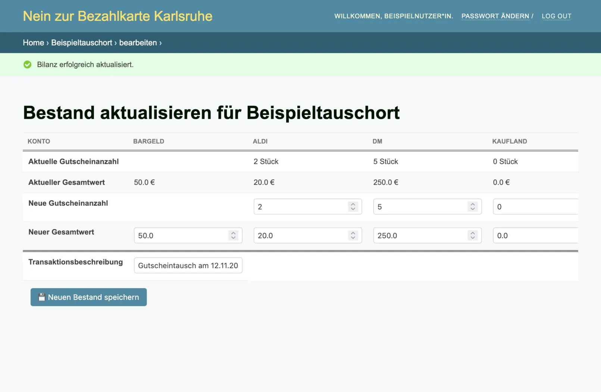

Dies ist die Anleitung für unsere interne Seite zum Erfassen des Gutscheinbestands.  
Die Seite ist zu finden unter:  
https://intern.nein-zur-bezahlkarte-karlsruhe.de (shortlink: https://i.nzbka.de).

### Inhaltsverzeichnis
[Login](#login)  
[Übersicht](#übersicht)  
[Kassenstand bearbeiten](#kassenstand-bearbeiten)  
[Passwort ändern](#passwort-ändern)  
[FAQ](#faq)

### Login
Melde Dich mit Deinem Username und Passwort unter https://intern.nein-zur-bezahlkarte-karlsruhe.de an.

### Übersicht
In der Übersicht ist zu sehen, wie viele der jeweiligen Gutscheine und wie viel Gutscheinwert zurzeit in der Kasse sind.
Um dies zu aktuallisiern, kann (unter Aktionen) auf Bearbeiten geclickt werden.

### Kassenstand bearbeiten
In der Übersicht bei Aktionen auf bearbeiten clicken um in die Bearbeiten-Ansicht zu gelangen. 
Dort sind in den ersten Zeilen die aktuelle Gutscheinanzahl bzw. die aktuellen Gutscheinwerte zu sehen.
In den unteren beiden Zeilen können die neue Gutscheinanzahl bzw. die neue Gutscheinwerte eingetragen werden.

Es wird einfach immer der aktuelle Stand eingetragen.  
In der Transaktionebeschreibung kann ein beliebiger Text hinzugefügt werden.  

Beachte: Es kann nur getauscht werden. Das bedeutet der Geldwert insgesamt muss immer gleich bleiben.
Falls dies nicht der Fall ist wird eine Fehlermeldung angezeigt.
In diesem Fall, den Bestand berichtigen.
Falls wirklich zu viel oder zu wenig in der Kasse ist, schreibt uns bitte persönlich.

Wenn das Bearbeiten erfolgreich war, erscheint eine grüne Benachrichtigung.
Die Werte sind dann auch auf der [Webseite](https://nein-zur-bezahlkarte-karlsruhe.de/tauschorte) aktualisiert.

### Passwort ändern
Falls Du von uns ein initiales Passwort bekommen hast, kannst Du dieses ändern.
Dafür oben rechts auf Passwort Ändern clicken und das alte sowie zweimal das neue Passwort eingeben.

### FAQ
#### Etwas funktioniert nicht. Was kann ich tun?
Melde Dich gerne bei uns über Deinen Kontakt oder über nein-zu-bezahlkarte-karlsruhe@riseup.net .
#### Wie kommen die Gutscheine zu mir und in das System?
Wenn nicht anders vereinbart, bringen wir die Gutscheine und holen das Bargeld in regelmäßigen Abständen ab.
Dabei tragen wir die Änderungen in das System ein.  

